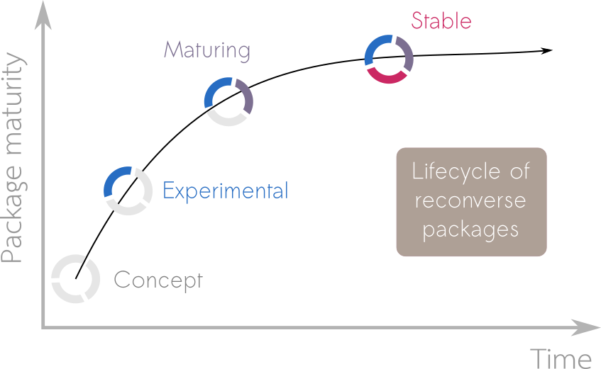

```{r setup, include=FALSE}
knitr::opts_chunk$set(echo = FALSE)
```

# Package lifecyle

```{r}
library(knitr)

```

<aside>
The [tidyverse](https://www.tidyverse.org) team introduced the concept of a
package (or function)
[lifecycle](https://lifecycle.r-lib.org/articles/stages.html). Our approach is
less granular (we do not consider individual functions) and uses slightly
different semantics but is still similar in nature.
</aside>

We think of packages in terms of where they are in their development lifecycle,
using 4 stages of package maturity to relay this to users:

## Concept
Initial ideas of what the package will be, maybe some gist of code and
discussions among developpers, but not much more.

## Experimental
Draft of a functional package, but interfaces and functionalities may change
over time, testing and documentation maye be lacking. Typically semantic
version < 0.1.0.

## Maturing
Package is functional, documented and tested. Can be used in production with the
understanding that the interface may still undergo minor changes. Typically
semantic version < 1.0.0.

## Stable
Package is functional, documented and tested. The interface is not meant to
change in the future. Can be used in production and relied upon by other
packages. Typically semantic version >= 1.0.0.


# Contributing
More info coming soon!

